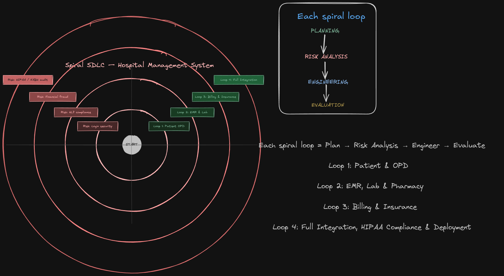

# Software-Engineering-Assignment
SE Assigntment
# Hospital Management System  
### SDLC Model: Spiral Model  

---

## Project Details

| Field              | Information                               |
|--------------------|-------------------------------------------|
| Course             | Software Engineering                      |
| Assignment Type    | Individual                                |
| Time               | 48 Hours                                  |
| Topic              | SDLC Model Selection & Justification      |

---

## 1. Introduction

A Hospital Management System (HMS) is a comprehensive, integrated software platform designed to manage the administrative, clinical, financial, and operational functions of a hospital or healthcare facility. It coordinates patient registration, appointment scheduling, doctor assignment, medical records (EMR/EHR), pharmacy inventory, laboratory management, billing and insurance processing, and reporting. :contentReference[oaicite:0]{index=0}  

An HMS is among the most complex categories of software systems due to the life-critical nature of its functions, strict regulatory compliance requirements (HIPAA, HL7, NABH standards), multiple stakeholder types (patients, doctors, nurses, lab technicians, administrators, insurance providers), and the need to handle sensitive personal health data securely. Given this complexity, the Spiral model is the most appropriate SDLC choice.

---

## 2. Selected SDLC Model: Spiral

The Spiral SDLC model combines the iterative nature of prototyping with the structured discipline of the Waterfall model. It is organized into repeated cycles (spirals), each consisting of four key phases:

**Plan → Risk Analysis → Engineering → Evaluation → Repeat**

Each iteration refines the system while identifying and mitigating risks early.

### Model Characteristics

| Aspect              | Description                                  |
|--------------------|----------------------------------------------|
| Model              | Spiral (Boehm’s Risk-Driven Model)           |
| Core Philosophy    | Continuous risk identification & mitigation  |
| Cycle Structure    | Plan → Risk → Build → Evaluate → Repeat      |
| User Involvement   | High (after every cycle)                     |
| Best For           | Large, high-risk, complex systems            |

---

## 3. Justification (Why Spiral?)

### 3.1 High Risk and Life-Critical Nature

Hospital systems deal with patient safety, prescriptions, lab results, and emergency workflows. Even minor software failures can have serious consequences. The Spiral model ensures every module undergoes strict risk analysis before development begins.

### 3.2 High Complexity with Multiple Modules

An HMS includes interconnected modules such as:
- OPD/IPD management  
- EMR systems  
- Pharmacy  
- Laboratory  
- Billing and insurance  

Designing everything upfront is impractical. Spiral allows gradual development and validation of each module.

### 3.3 Regulatory Compliance and Security

Healthcare software must comply with:
- HIPAA (privacy)  
- HL7 / FHIR (data exchange)  
- NABH (accreditation standards)  

Spiral ensures compliance risks are evaluated and handled in each iteration.

### 3.4 Evolving Requirements

Healthcare systems evolve with:
- Government policies  
- New medical technologies  
- Updated standards  

Spiral accommodates such changes without restarting development.

### 3.5 Prototyping and Stakeholder Feedback

Doctors, nurses, and administrators may not be technical users. Prototypes allow them to:
- Visually validate features  
- Provide early feedback  
- Reduce development errors  

---

## 4. Comparison with Other Models

### 4.1 Waterfall Model — Not Suitable

- Requirements cannot be fully defined at the beginning  
- No dedicated risk analysis phase  
- Testing occurs too late  
- Lack of early feedback from medical staff  

### 4.2 Agile Model — Not Fully Suitable

- Limited documentation (not acceptable in healthcare)  
- No structured risk analysis  
- Partial deployments are risky  
- Informal process conflicts with hospital approval systems  

---

## 5. Spiral SDLC Diagram

The following diagram represents the Spiral lifecycle for the Hospital Management System:

### Diagram References

For reference and editing:

- **Excalidraw File:** `hospital-management-system.excalidraw`  
- **Excalidraw Link:** [Open Diagram](PASTE_YOUR_LINK_HERE)

> The diagram can be edited using https://excalidraw.com

---

### Spiral Cycle Breakdown

| Loop    | Planning                              | Risk Analysis                          | Build                                | Evaluation                    |
|--------|----------------------------------------|----------------------------------------|--------------------------------------|------------------------------|
| Loop 1 | Patient & OPD module requirements      | Privacy risks, login security          | Patient Registration, OPD             | Admin review                 |
| Loop 2 | EMR and Lab planning                  | Data integrity, HL7 compliance         | EMR, Lab, Pharmacy                   | Doctor & nurse review        |
| Loop 3 | Billing & Insurance planning          | Financial accuracy, fraud risks        | Billing, Insurance, Reports          | Finance team review          |
| Loop 4 | Full integration & compliance         | HIPAA, NABH audit risks                | Integration, UAT, Security testing   | Final stakeholder approval   |

---

### Process Flow

Planning --> Risk Analysis --> Engineering --> Evaluation --> Repeat (next spiral)

---

## 6. Conclusion

The Spiral SDLC model is the most suitable choice for developing a Hospital Management System. Its risk-driven approach ensures that every critical component is validated before implementation, making it ideal for life-critical systems.

The model effectively handles system complexity, supports evolving requirements, ensures regulatory compliance, and enables continuous stakeholder feedback. Compared to Waterfall and Agile, the Spiral model provides the best balance between structure, flexibility, and risk management, making it the ideal framework for healthcare software systems.

---

